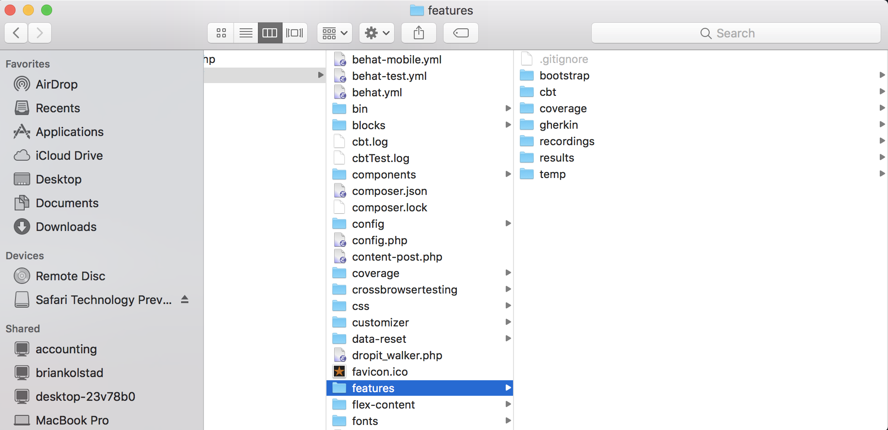

Use `behat.yml` to define your `Suites` and `Contexts`.

## Directory & files within `features` 

the directory structure of a `QANoErr` project is contained under the main root directory `features`.  These are the directories within `features`:


*  **bootstrap**: This contains the `ProjectContext.php`
   *  **pages**:  This is where your **QANoErr Chrome Extension** generated POM should exist
*  **cbt**: Files that support testing on CrossBrowserTesting
*  **coverage**: If you have a PHP project and you run the `coverage` task
*  **gherkin**: Location of Gherkin templates consisting of:
   * **hbs.features**:  The `handlebar` templates 
   * **snippet.features**: The `snippet` features referenced by the `hbs` features
   * **partial.features**: The 'partial' features referenced by the `hbs` features
*  **results**: when running CrossBrowserTesting, the reports are generated here
*  **temp** The composer command `composer behat-prep` processes the files in the `gherkin` directory and generates `features` in the **temp**.   The `behat.yml` references the `suites` in the **temp**.

## Review of the main `behat.yml`

Here's an example `behat.yml` for review:

```
default:
  suites:
    home:
      paths: ["%paths.base%/features/temp/home.feature"]
      contexts: [ProjectContext]
    admin:
      paths: ["%paths.base%/features/temp/admin.feature"]
      contexts: [ProjectContext]
  extensions:
    Behat\MinkExtension:
      browser_name: 'chrome'
      javascript_session: selenium2
      selenium2:
        wd_host: http://0.0.0.0:4444/wd/hub
      base_url: https://twlwdev.wpengine.com

    SensioLabs\Behat\PageObjectExtension:
      namespaces:
        page: [pages]
        element: [pages]

```
We define each of our `Suites` separately as shown above.  This is because you can run a particular `Suite` by using this command line:

`vendor/bin/behat --config behat.yml --suite home` and that will run the `home` suite.  If you run only `vendor/bin/behat --config behat.yml` then all the defined suites will run.

Each `Suite` has two values:

*  **paths**: where is the feature and what is it's name
*  **contexts**: which Context is used. Typically all our `Suites` use the same `Context`, which in this case is `ProjectContext`.


The `Behat\MinkExtension` provides an API that is browser independent.  In the case here, we are specifically using the `browser_name` **chrome**.  Other accepted values are **firefox** and **safari**.

When running locally, we need to supply the `wd_host`.  This is the **address** of the running `composer selenium-server` command.

The `base_url` is the address of the base page.  As we move our code from `local dev`, to `dev` to `staging` to `prod`, we can change this `base_url` and run our tests w/o any other change.

The `SensioLabs\Behat\PageObjectExtension` extension needs to know what the `namespaces` are, which is always `pages`.

## How to use behat.yml

There are a number of ways to run behat.

*  **composer**: `composer behat` which will run `composer behat-prep` and then run `behat`
*  **command line - all suites**: `vendor/bin/behat --config behat.yml` 
*  **command line - specif suite**: `vendor/bin/behat --config behat.yml --suite suitename`

## Use w/ `psysh`

If you are interested in doing some debugging, you must run `behat` from the `command line` as shown above.  If you use the `composer` approach, `behat` will not pause when encountering a `eval(\Psy\sh());` statement.  If you run from the `command line`, `behat` will pause when encountering the `eval(\Psy\sh());`
