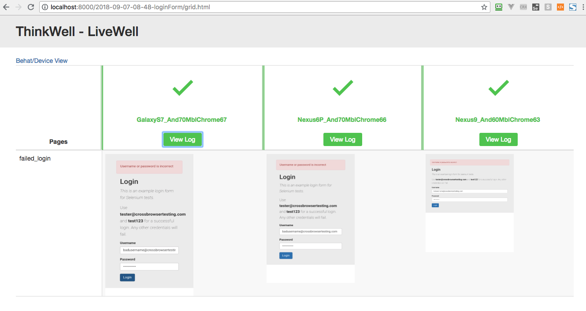
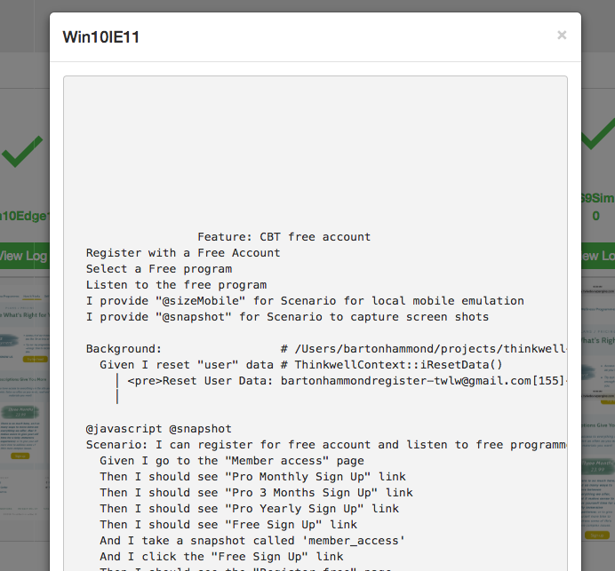
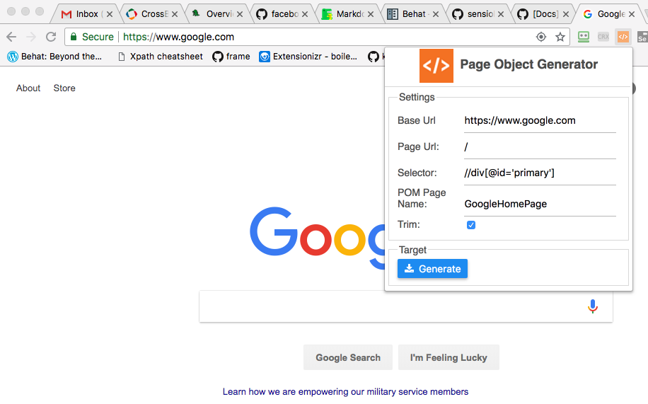
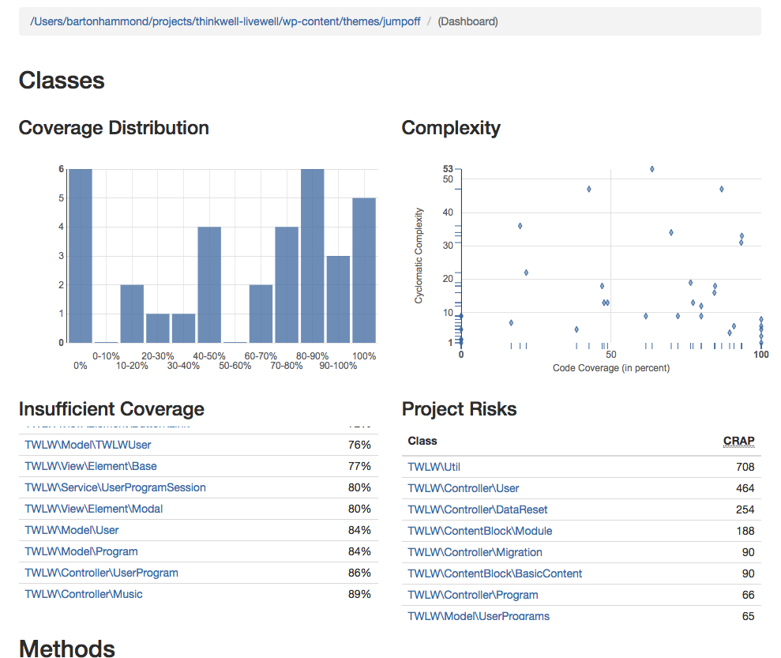
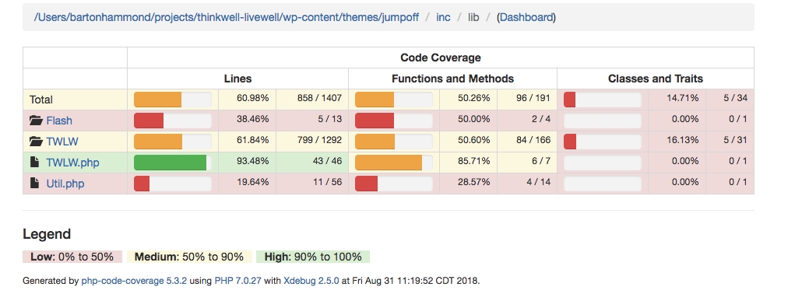
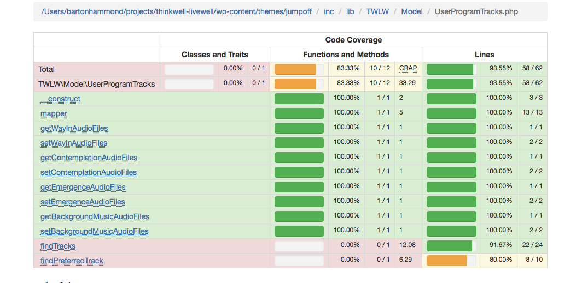

The following provides a high level overview of the **QANoErr** project.

## Web Applications
This project is geared towards responsive web applications running on desktops and mobile devices. 

## PHP
PHP is the scripting language.

## Behat Gherkin
Using the Behavior Driven Development tool [Behat](http://behat.org), you can create Scenarios and Features that describe the business while also providing the ability to perform Test Automation.

The following is a custom report provided by QaNoErr that is generated during test automation.  It shows the Gherkin steps that were executed along w/ images capturing the web page:

Custom report for a specific device that includes the `Gherkin` statements along with the snapshots.


Also included w/ QaNoErr is a "Grid" report - it shows all the device runtime logs and snapshots of the pages that were navigated.  This provides a powerfull report that helps determine if the UI on each device is working well.

Notice below, how the `Win10IE11` device failed the test.  Also, the left most column defines which page the snapshots are from.  In this case, it is the `member_access` page.  You can sroll the report to the right and left to compare the snapshots from multiple devices.



If you click the `View Log` on the failed test of device `Win10IE11` you can see the log from that particular test:



## Page Object Model (POM)
The POM approach for accessing Web Applications is provided by [Behat Page Object Extension](https://github.com/sensiolabs/BehatPageObjectExtension).  The POM contains important information such as
*  The URL of the page
*  The accessors for each of the business elements
*  Support for extending the POM
To create a POM, this project provides a Chrome Extension, *Page Object Generator*, described below.

The POM design help seperates the access to elements on a web page from the Gherkin that is interacting with the page.  Rather then have XPath selectors with in the Gherkin code, the POM approach makes the Gherkin much more business like.  So rather the have the Gherkin contain selector type logic, it just interacts w/ the POM page.  This way, also, if the page changes the element to a different name or XPath selector, the change only happens in one place: the POM itself.

The QaNoErr POM objects are based upon a `Base` object.  The `Base` has the common accessors such as `clickTheButton` and `fill` a text input field.  All generated POM objects inherit from the `Base` object.

Following is an example of a generated POM.  Note that if there is a `<Base>Extend.php` class available, it will be included.  During the `__construct` method, if the `<Base>Extend.php` exists, then any elements defined within the `addToElements` function will be added.  This provides the ability to add XPath accessors that the Chrome Extension did not generate.


```php

<?php
namespace pages;
use Wisnet\BehatPom\Utility;
use Wisnet\BehatPom\Base;

//baseUrl: https://www.twlw.dev
//pageUrl: /programmes/{id}/session/start/
//selector: //div[@class='modal-dialog']
//trim: true
//version: 0.0.8
//date: Wed May 16 2018 09:58:23 GMT-0500 (CDT)

/*
*  Extend class provides support for overriding all the functions
*/
if (file_exists('features/bootstrap/pages/BeforeYouFinishExtend.php')){
    include 'features/bootstrap/pages/BeforeYouFinishExtend.php';
}
class BeforeYouFinish extends Base {
  protected $path = "/programmes/{id}/session/start/";
  
  protected $elements = [
    "Start Session" =>
    [
      "xpath" => "//a[text()='Start Session']"
    ],
  ];
   /*
   * Create variable if BeforeYouFinish exists
   */
    public function __construct($session, $factory, $parameters) {
        parent::__construct($session, $factory, $parameters);

        if (file_exists('features/bootstrap/pages/BeforeYouFinishExtend.php')) {
            $this->extend = new \pages\BeforeYouFinishExtend;
             $this->extend->addToElements($this);  	    
        }
    }
}

```

The following class is the Extension, which is optional.  The function `addToElements` allows for additional XPath selectors.  Also, we'll see later, how to override functions w/in the `Base` class at runtime.

```php
<?php
namespace pages;

class BeforeYouFinishExtend {

    public function addToElements($parent) {
        //Spinner for publishing
        $xpath = array("xpath" => "//button[contains (@class, 'js-save-progress')][text()='Enter']");
        $parent->_addToElements("Submit", $xpath);

    }
}
```

## Behat POM Library

There are numerous classes provided with QaNoErr to manage the Automation Process.  Here is a list of the classes w/ a brief description

Class Name | Builds the BDD Report | Description
---------- | --------------------- | -----------
Base       | No | Extends SensioLabs Page Object Extension Page.  Contains common function for accessing page.
BehatData  | Yes |  Simple class used to build Behat BDD Report
BehatFeature | Yes |  Contains Scenarios and Feature information.
BehatScenario | Yes | Contains the Scenario title.
BehatStep | Yes | Contains Text, Type, Snapshot image
BehatSuite | Yes | Contains Features
CheckParallelTest | No | Waits for Automation Test on CrossBrowserTesting to complete.
CurlSupport | No | Utility class for interacting w/ CrossBrowserTesting w/ Curl
FeatureContext | No | Main interface between Gherkin features and POM Base
GridReport | Yes | Processes data generated during BDD run to build Grid report
Utility | No | Contains reusable function

## Chrome Extension: Page Object Generator
The Chrome Extension is utilized when the business web app is to be processed.  The user navigates to the page to be tested and then invokes the Extension.  

## Snippets
When writing Gherkin, many times there are situations what will be repeated from script to script.  Take for example a Customer Login action.  There will most likely be many Features that require a Customer Login.  Rather then copy and paste these steps for the Customer Login, instead you can create a `snippet`.

Here's an example of what the Gherkin looks like when the snippet is referenced, notice the `{{{clientLogsIn}}}`
```gherkin
Feature: 3 Month Programme
  In order to utilize a programme
  As a 3 Month membership
  I want to pay for 3 month 

  Background:
{{{clientLogsIn}}}  

  @javascript @wip
  Scenario: I can see available programme
    Given I go to the "Client menu" page
    Given I click the "Wellness Programmes" link
```

And here is the `clientLogsIn` snippet.
```gherkin
    When I go to the "Home" page
    And I click the "Log In" link
    Then I should see the "Log in" page
    Given I fill the "user_login" with "someuser@gmail.com"
    And I fill the "user_pass" with "12345678a"
    And I take a snapshot called 'login'
    And I click the "wp-submit" button
    Then I should see the "Dashboard" page
```

## Partials
A `partial` is very simular to a `snippet` in that it code that can be referenced by a Gherkin step but it also provides the ability to pass parameters in.  Take for example a Quiz that has multiple questions and each question has 4 options that have to be ranked in some order.  Here's what a `Quiz` gherkin might look like.  Notice how there are multiple variables (e.g. `question0`) and different values.


```gherkin
Feature: Sensory Quiz
  As a registered user
  I can take the sensory quiz 
  I can view the results
  

  Background:
{{{clientLogsIn}}}  

  @javascript 
  Scenario: I can the sensory quiz with majority of Answers are Audio
#first question  
{{>sensoryQuiz question0="A1 L3 V2 K4" question1="A1 L3 V2 K4" question2="A1 L3 V2 K4" question3="A1 L3 V2 K4"  question4="A1 L3 V2 K4" question5="A2 L4 V1 K3" question6="A2 L4 V1 K3" question7="A2 L4 V1 K3" question8="A2 L4 V1 K3" result="Audio"}}

  @javascript 
  Scenario: I can the sensory quiz with majority are Visual
{{>sensoryQuiz question0="A2 L3 V1 K4" question1="A2 L3 V1 K4" question2="A2 L3 V1 K4" question3="A2 L3 V1 K4" question4="A2 L3 V1 K4" question5="A1 L3 V2 K4" question6="A1 L3 V2 K4"  question7="A1 L3 V2 K4"  question8="A1 L3 V2 K4" result="Visual"}}
```

And here is a portion of the `sensoryQuiz` partial:
```gherkin
    Given I go to the "Sensory quiz" page
#first question
    And I click the "Question 0 for {{substring question0 0 1}} with {{substring question0 1 1}}" button
    And I click the "Question 0 for {{substring question0 3 1}} with {{substring question0 4 1}}" button
    And I click the "Question 0 for {{substring question0 6 1}} with {{substring question0 7 1}}" button
    And I click the "Question 0 for {{substring question0 9 1}} with {{substring question0 10 1}}" button
    And I take a snapshot called 'question_1'
```

And the generated result will look something like this:
```gherkin
    Given I go to the "Sensory quiz" page
#first question
    And I click the "Question 0 for A with 1" button
    And I click the "Question 0 for L with 3" button
    And I click the "Question 0 for V with 2" button
    And I click the "Question 0 for K with 4" button
    And I take a snapshot called 'question_1'
```
We'll look into how this is done later so that when you encounter some need for a `partial` you'll know how it works.

## Psysh

[psysh](http://psysh.org/) is a runtime developer console, interactive debugger and REPL for PHP.  This is included w/ `QaNoErr` and makes it easy to debug the PHP scripts.

## CBT - CrossBrowserTesting

If you want to run against devices that aren't available locally, you can create an account with [CrossBrowserTesting.com](https://crossbrowsertesting.com) and running against multiple devices.  QaNoErr provides the mechanisms to run the same script while changing out the device.  For example, with a list of devices such as below, running `vendor/bin/buildCBTTests`

**List of devices:**

```
[
    {
	"os_api_name": "GalaxyS7-And70",
	"browser_api_name": "MblChrome67"    
    },
    {
	"os_api_name": "iPhoneX-iOS11",
	"browser_api_name": "MblSafari11.0"
    },
    {
	"os_api_name": "Mac10.13",
	"browser_api_name": "Chrome62x64"
    },
    {
	"os_api_name": "Win10",
	"browser_api_name": "Edge17"
    }    
]
```
One command and the desired script will run against each device.  Only one device runs at a time so for those folks who don't want to pay the extra charge associated w/ concurrent Automation Tests, this is really helpful.  QaNoErr will only submit the automation script once there are no currently running device.

Here is a screenshot showing a few devices that were tested on CrossBrowserTesting.


## Code Coverage

Everything you need to know on getting a Mac setup to acquire Code Coverage results from your test runs is documented.  Our setup uses [MAMP Pro](https://www.mamp.info/en/mamp-pro/).  We provide instructions on getting XDebug working and how to setup the environment for data acquisition.

Here are some example reports from Code Coverage:

This is the Dashboard:


And this is an example of drilling into the code to see what has been covered:


And the following shows the functions w/in a class and their coverage:


